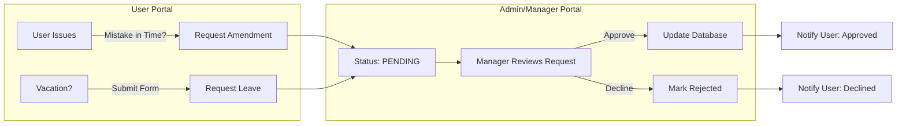
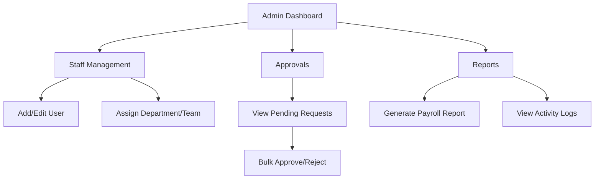

# Application Process Flow

This document visualizes the user journey and operational logic of the Attendance Application.

## 1. Authentication & Onboarding Flow
This is the entry point for all users.

```mermaid
flowchart TD
    Start[User Opens App] --> Login{Login Page}
    Login -->|Sign in with Google| AuthCheck[Google Authentication]
    
    AuthCheck -->|Success| DomainCheck{Email Domain Verified?}
    AuthCheck -->|Fail| LoginError[Show Error]
    
    DomainCheck -->|No| AccessDenied[Access Denied Page]
    DomainCheck -->|Yes| DBCheck{User Exists in DB?}
    
    DBCheck -->|No| CreateUser[Create User Account]
    CreateUser --> Onboarding[Onboarding Flow\n(Select Location, Manager)]
    Onboarding --> UserDash
    
    DBCheck -->|Yes| RoleCheck{Check User Role}
    
    RoleCheck -->|USER| UserDash[User Dashboard]
    RoleCheck -->|MANAGER| MgrDash[Manager Dashboard]
    RoleCheck -->|ADMIN| AdminDash[Admin Portal]
```

## 2. User Daily Workflow (Attendance)
The core loop for a regular employee.

```mermaid
flowchart TD
    UserDash[User Dashboard] --> StatusCheck{Current Status?}
    
    StatusCheck -->|Clocked Out| ActionIn[Click 'Clock In']
    ActionIn --> ModeSel{Select Mode}
    ModeSel -->|Office| StateWorking[State: WORKING\n(Timer Running)]
    ModeSel -->|WFH| StateWorking
    
    StateWorking --> ActionBreak[Click 'Start Break']
    ActionBreak --> StateBreak[State: ON BREAK\n(Break Timer)]
    
    StateBreak --> ActionEndBreak[Click 'End Break']
    ActionEndBreak --> StateWorking
    
    StateWorking --> ActionOut[Click 'Clock Out']
    ActionOut --> Summary[View Day Summary]
    Summary --> StateOut[State: CLOCKED OUT]
```

## 3. Request & Approval Cycle
How data changes move from User to Admin.



## 4. Admin Management Flow


